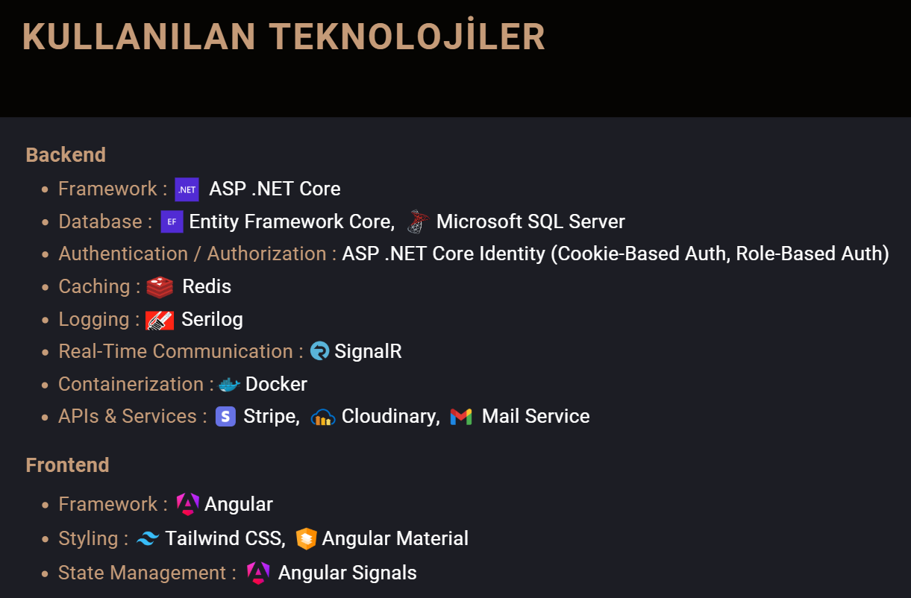
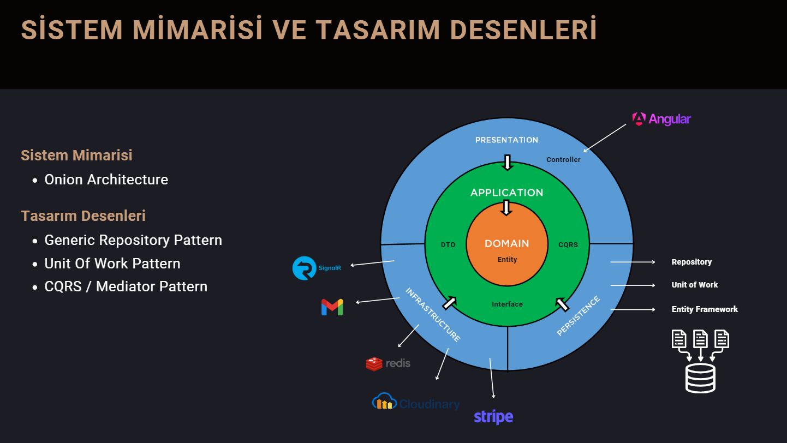

# E-Commerce Project

Welcome to the E-Commerce project created for the Techcareer.net bootcamp Full-Stack Developer.

PDF => [Full-Stack Bootcamp PDF File](https://github.com/karadagserhat/.NET-Core-eCommerce/blob/main/net-core-bootcamp.pdf)

# Used Technologies



# System Architecture and Design Patterns



# Running the project

To run this project locally you will need to have installed:

1. Docker
2. Asp .Net SDK v8
3. NodeJS (at least version 20.\* )
4. Clone the project in a User folder on your computer by running:

```bash
# you will of course need git installed to run this
git clone https://github.com/karadagserhat/.NET-Core-eCommerce.git
cd .NET-Core-eCommerce
```

5. Restore the packages by running:

```bash
# From the solution folder (.NET-Core-eCommerce)
dotnet restore

# Change directory to client to run the npm install.
cd client
npm install
```

6. Most of the functionality will work without Stripe, Cloudinary and Mail Service but if you wish to see the payment,photo and mail functionality working too then you will need to create a Mail, Stripe and Cloudinary account and populate the keys. In the Presentation\ECommerceBackend.API folder create a file called **‘appsettings.json’** with the following code:

```json
{
  "Logging": {
    "LogLevel": {
      "Default": "Information",
      "Microsoft.AspNetCore": "Warning"
    }
  },
  "ConnectionStrings": {
    "DefaultConnection": "Server=localhost,1433;Database=eCommerce;User Id=SA;Password=Password@1;TrustServerCertificate=True",
    "Redis": "localhost"
  },
  "AngularClientUrl": "https://localhost:4200",
  "StripeSettings": {
    "PublishableKey": "pk_test_REPLACE-ME",
    "SecretKey": "sk_test_REPLACE-ME"
  },
  "CloudinarySettings": {
    "CloudName": "REPLACE-ME",
    "ApiKey": "REPLACE-ME",
    "ApiSecret": "REPLACE-ME"
  },
  "Seq": {
    "ServerUrl": "http://localhost:5341/"
  },
  "Mail": {
    "Username": "REPLACE-ME",
    "Password": "REPLACE-ME",
    "Host": "smtp.gmail.com"
  },
  "AllowedHosts": "*"
}
```

7. The app uses both Sql Server, Redis and Seq library. To start these services then you need to run this command from the solution folder. These are both configured to run on their default ports so ensure you do not have a conflicting DB server running on either port 1433 or port 6379 on your computer:

```bash
# in the .NET-Core-eCommerce folder (root directory of the app)
docker compose up -d
```

8. You can then run the app and browse to it locally by running:

```bash
# run this from the API folder
cd Presentation\ECommerceBackend.API
dotnet run
```

9. You can then browse to the app on https://localhost:5001<br><br>
10. If you wish to run the Angular app in development mode you will need to install a self signed SSL certificate. The client app is using an SSL certificate generated by mkcert. To allow this to work on your computer you will need to first install mkcert using the instructions provided in its repo [here](https://github.com/FiloSottile/mkcert), then run the following command:

```bash
# cd into the client ssl folder
cd client/ssl
mkcert localhost
```

11. You can then run both the .Net app and the client app.

```bash
# terminal tab 1
cd Presentation\ECommerceBackend.API
dotnet run

# terminal tab 2
cd client
ng serve
```

12. Then browse to [https://localhost:4200](https://localhost:4200)

# Features

##### Backend

- System Architecture (**Onion Architecture**)
- Design Patterns (**Generic Repository Pattern**, **Unit Of Work Pattern**, **CQRS / Mediator Pattern**)
- CRUD Operations
- Sorting, Filtering, Searching, Pagination
- ASP .NET Core Identity (**Cookie-Based Auth, Role-Based Auth**)
- File Upload (**Cloudinary**)
- Global Error Handling
- Real Time Communication (**SignalR**)
- Caching (**Redis**)
- Logging (**Serilog**)
- Payment Service (**Stripe**)
- Mail Service
- ORM (**Entity Framework Core**)
- Containerization (**Docker**)

##### Frontend

- Light - Dark Mode
- Angular Reactive Forms
- Auth - Admin Guards
- State Management (**Angular Signals**)
- Reusable Components
- Global Error Handling
- Dialog, Loading, Notification Service
- Modern UI Styling (**Tailwind CSS, Angular Material**)
- Lazy Loading
